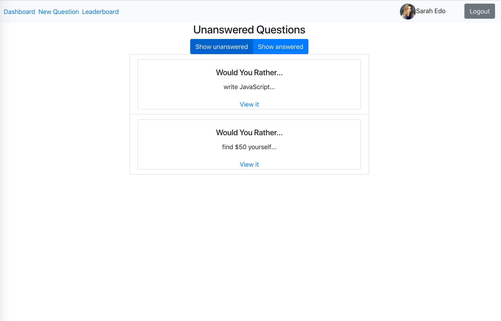
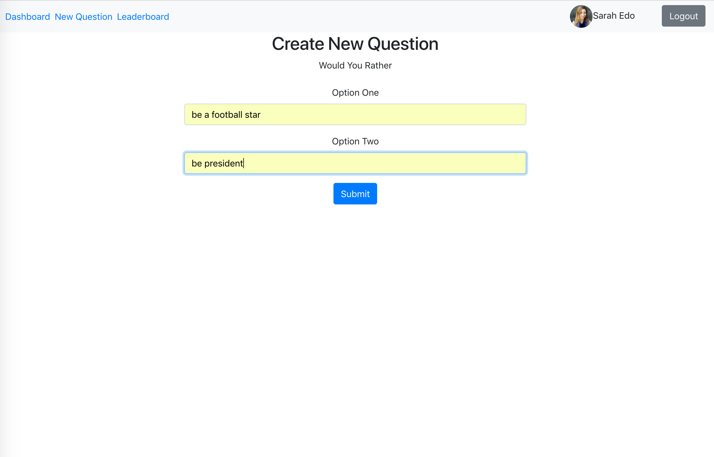

# Would You Rather Project

This application lets a user play the “Would You Rather?” game. The game goes like this: A user is asked a question in the form: “Would you rather [option A] or [option B] ?”. Answering "neither" or "both" is against the rules.

In this app, users are able to answer questions, see which questions they haven’t answered, see how other people have voted, post questions, and see the ranking of users on the leaderboard.

## Features
* Log in as an existing user
* Browse unanswered and answered questions
* Answer a question by selection one of the two available options
* Stats for a particular answered question: see how many people voted for which option
* Add new questions
* Leaderboard: See, who's the most active user in the game

## Screens
### Dashboard

### Question stats

### New question

### Leaderboard

### Login

# Getting started

## Download

Clone this repository: `git clone https://github.com/GoestaO/wouldyourather.git`

## Installation

Run `npm install` in a terminal from the main folder of the application

## Execution

After the installation run `npm start` from the same location.

# Built with
* [React](https://reactjs.org/)
* [React Redux](https://github.com/reduxjs/react-redux)
* [React Router](https://github.com/ReactTraining/react-router)
* [Reactstrap](https://reactstrap.github.io/)

# Author
* [Gösta Ostendorf](https://github.com/GoestaO)
